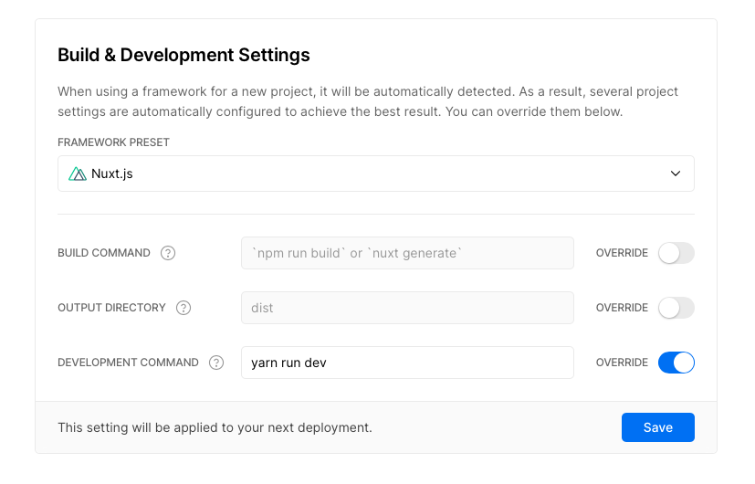

# Vercel example

## Development

You need to have package `vercel` globally installed:

```sh
yarn global add vercel
```

Make sure to add `yarn run dev` on the _Development command_, on the settings of your project on vercel.com:



Then you can run the following command to have a local development experience

```sh
vc dev -A vercel.dev.json
```

## Deployment

Any lambdas added to `api/` must be added to the `routes` config in the `vercel.json` file.
